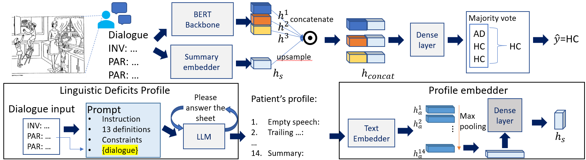

# EMBC2024
---
This repo supports the paper "Profiling Patient Transcript Using Large Language Model Reasoning Augmentation for Alzheimer's Disease Detection", and provides the [prompt](https://github.com/JackingChen/Reason_Augment_AD_detect/blob/main/prompts.py) and the code of the main architecture (BERTbackbone+the classification dense layers). The final proposed prompt is denoted as psych_ver_1.1, which is in line 314, the value assigned to **Direct_template['psych_ver_1.1']** in the file [prompt.py](https://github.com/JackingChen/Reason_Augment_AD_detect/blob/main/prompts.py)

---

To execute the codes, the first step is to download the [ADReSS dataset](https://dementia.talkbank.org/ADReSS-2020/). Since the data is under strict data usage constraint, we cannot provide the dataset in this repo, and you will have to apply for permission to use this dataset. 

Once you get the dataset, the data structure will be something like
.
├── clips
├── csv_gen.py
├── dev.tsv
├── test.tsv
├── train.tsv

Then specify the train, dev, test data and manage to create train.csv, dev.csv, test.csv, where in each csv, there should be four columns: path, text dementia_labels, ID:

| path | text | dementia\_labels | ID |
| :-- | :-- | :-- | :-- |
| S183\_PAR\_5\_XX\_XX.wav | XXX | 0 | S183 |

and collect the csvs in a same folder like:
<your folder name>
├── dev.csv
├── test.csv
└── train.csv

these are the **raw_input_files**, and until now, the material needed is ready.

The next step is to create personal profile and turn them into embedding. This can be done by:

### Extract profile embedding
`bash run_Extract_feat.sh`

run_Extract_feat.sh executes two python scripts: Extract_Session_text.py, PsychSummary2Embedding.py. Be aware to replace the file route should match the exact one in your computer. 
    
    
In Extract_Session_text.py, we call Azure openai with the engine gpt-turbo3.5. please be sure if you have credential to use this tool. Similarly PsychSummary2Embedding.py embedds the text-form response from gpt-turbo3.5. We also use Azure openai's embedder so make sure you have access to the service.
    
bash run_Extract_feat.sh inputs the raw_input_files and outputs the augmented raw_input_files
<output folder of PsychSummary2Embedding.py>
├── dev.pkl
├── test.pkl
└── train.pkl

These files together with the raw_input_files will be the input to the Reasoning Augmented BERT

---
    
Once you've done the data preparation and preprocessing, execute run.sh
    
### run Reasoning Augmented BERT

`bash run.sh`
    
